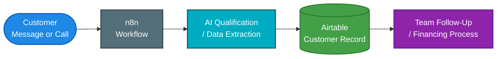
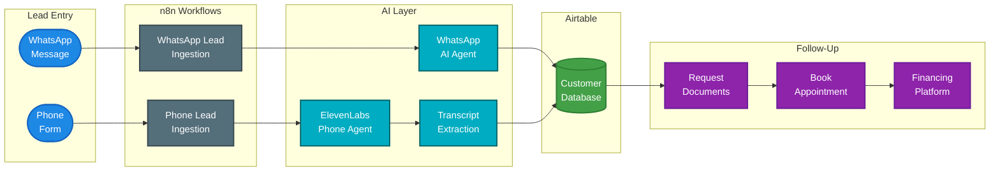
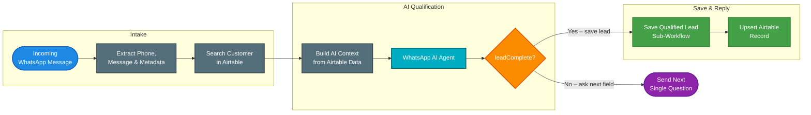
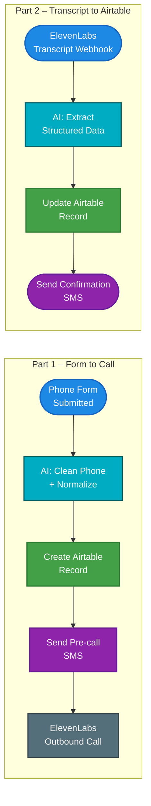
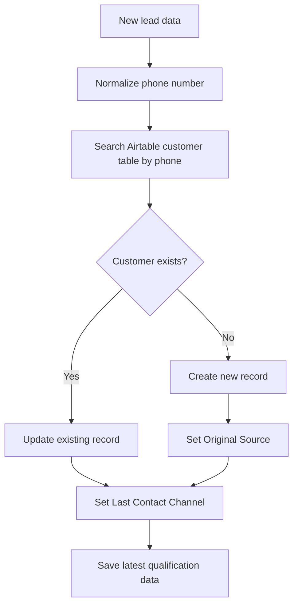
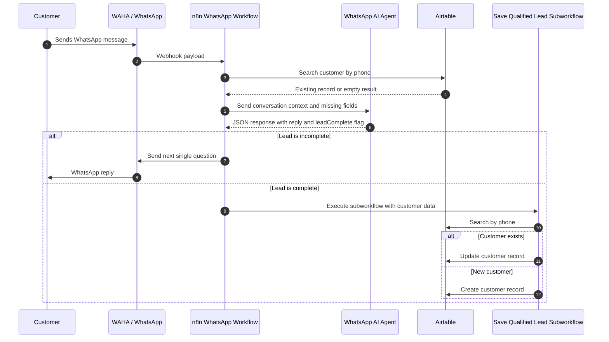
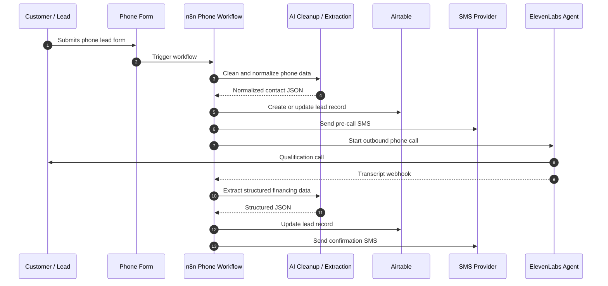
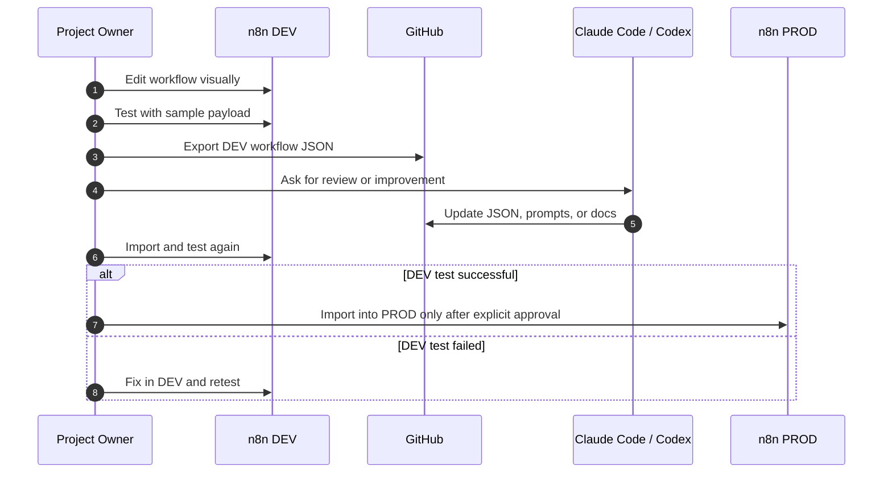
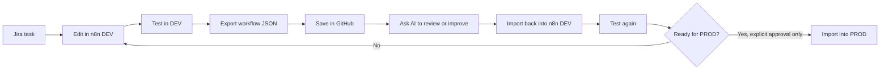

# Kameni n8n Automation Project

A documentation-first automation project for **real estate financing lead qualification**.

This repository contains exported n8n workflow JSON files, AI prompts, documentation, and project rules for building and maintaining automated WhatsApp and phone-based lead intake processes.

The goal is simple:

> Capture financing leads, qualify them through WhatsApp or phone, store the structured customer data in Airtable, and prepare the case for the next financing steps.

---

## Table of Contents

- [Kameni n8n Automation Project](#kameni-n8n-automation-project)
  - [Table of Contents](#table-of-contents)
  - [Project Purpose](#project-purpose)
  - [Big Picture](#big-picture)
  - [Main Systems](#main-systems)
  - [Repository Structure](#repository-structure)
  - [Environment Strategy: DEV vs PROD](#environment-strategy-dev-vs-prod)
    - [Golden Rule](#golden-rule)
    - [Why this matters](#why-this-matters)
  - [High-Level System Flow](#high-level-system-flow)
  - [WhatsApp Flow](#whatsapp-flow)
    - [Purpose](#purpose)
    - [Main Workflows](#main-workflows)
    - [Simplified WhatsApp Flow](#simplified-whatsapp-flow)
    - [WhatsApp Qualification Fields](#whatsapp-qualification-fields)
    - [Important WhatsApp Rules](#important-whatsapp-rules)
  - [Phone Flow](#phone-flow)
    - [Purpose](#purpose-1)
    - [Simplified Phone Flow](#simplified-phone-flow)
    - [Phone Agent Data Collection](#phone-agent-data-collection)
  - [Airtable Data Model](#airtable-data-model)
    - [Core Airtable Logic](#core-airtable-logic)
    - [Environment Isolation](#environment-isolation)
  - [UML-Style Sequence Diagrams](#uml-style-sequence-diagrams)
    - [WhatsApp Lead Qualification Sequence](#whatsapp-lead-qualification-sequence)
    - [Phone Lead Qualification Sequence](#phone-lead-qualification-sequence)
    - [DEV to PROD Promotion Sequence](#dev-to-prod-promotion-sequence)
  - [AI Tooling and MCP Servers](#ai-tooling-and-mcp-servers)
    - [Claude Code](#claude-code)
    - [Codex CLI and Other AI Tools](#codex-cli-and-other-ai-tools)
    - [Shared AI Rule](#shared-ai-rule)
    - [MCP Safety](#mcp-safety)
  - [Development Workflow](#development-workflow)
    - [Step-by-Step](#step-by-step)
  - [Testing Workflow](#testing-workflow)
    - [Manual Test Checklist](#manual-test-checklist)
  - [Promotion from DEV to PROD](#promotion-from-dev-to-prod)
    - [PROD Checklist](#prod-checklist)
  - [Security Rules](#security-rules)
  - [Important Project Rules](#important-project-rules)
    - [Workflow Rules](#workflow-rules)
    - [AI Prompt Rules](#ai-prompt-rules)
    - [Airtable Rules](#airtable-rules)
    - [Customer Communication Rules](#customer-communication-rules)
  - [Documentation Map](#documentation-map)
  - [Glossary](#glossary)
  - [Recommended Daily Working Style](#recommended-daily-working-style)

---

## Project Purpose

This project supports the financing intake process for **Kameni Immobilien – Baufinanzierung**.

The automation helps with:

- receiving new leads from WhatsApp
- receiving new leads from phone calls
- asking qualifying questions
- saving structured customer information in Airtable
- detecting whether the customer profile is complete
- starting or updating a customer record
- preparing the next financing steps
- documenting all workflows in GitHub
- allowing AI tools like Claude Code and Codex CLI to help safely

This is not a classical software project with app source code. It is a **no-code / low-code automation repository** where the real logic lives mainly in:

- n8n workflow JSON files
- Airtable table structure
- AI prompts
- documentation
- project rules for AI tools

---

## Big Picture

The project follows this simple operating model:



GitHub is used as the version history and backup for the exported workflows and documentation.

---

## Main Systems

| System | Purpose |
|---|---|
| n8n | Main workflow automation platform |
| Airtable | Central database / CRM for lead and customer data |
| WhatsApp / WAHA | WhatsApp message intake and replies |
| ElevenLabs | Phone AI agent and call conversation handling |
| GitHub | Version control for workflows and documentation |
| Jira / Atlassian | Task tracking |
| Claude Code | AI development assistant with MCP tools |
| Codex CLI | AI development assistant using `AGENTS.md` |
| Dropbox / Google Drive | Document collection and document storage |
| Starpool / Europace / BaufiSmart | Financing platform process after qualification |

---

## Repository Structure

```text
kameni-n8n-automation/
├── .claude/
│   └── ...                         # Optional Claude Code local settings
│
├── archive/
│   └── ...                         # Old or deprecated files
│
├── docs/
│   ├── airtable-fields.md          # Airtable schema and field rules
│   ├── lead-process.md             # End-to-end financing lead process
│   ├── phone-call-flow.md          # Phone workflow explanation
│   ├── whatsapp-flow.md            # WhatsApp workflow explanation
│   └── system-ids.md               # Non-secret IDs for DEV and PROD systems
│
├── prompts/
│   ├── phone-confirmation-sms.md
│   ├── phone-contact-cleanup.md
│   ├── phone-transcript-extraction.md
│   └── whatsapp-agent.md
│
├── tests/
│   ├── sample-whatsapp-webhook.json
│   └── sample-call-transcript.json
│
├── workflows/
│   ├── phone/
│   │   └── ...                     # Exported phone workflow JSON files
│   │
│   └── whatsapp/
│       ├── save-qualified-lead-sub.json
│       └── whatsapp-lead-ingestion-main.json
│
├── AGENTS.md                       # Shared instructions for Codex CLI and other AI tools
├── CLAUDE.md                       # Claude Code specific instructions
├── README.md                       # Main project overview
└── .gitignore
```

---

## Environment Strategy: DEV vs PROD

This project uses two environments:

| Environment | Purpose |
|---|---|
| DEV | Build, test, debug, and improve workflows |
| PROD | Real customer-facing workflows |

### Golden Rule

> Work only on DEV by default.

Never edit, activate, publish, overwrite, or import into PROD unless the user explicitly says:

```text
Apply this to PROD
```

### Why this matters

DEV allows safe testing without affecting real customer workflows. PROD is connected to real customer communication and should only be changed after successful DEV testing.

The file `docs/system-ids.md` stores non-secret IDs such as:

- n8n DEV workflow IDs
- n8n PROD workflow IDs
- Airtable DEV table IDs
- Airtable PROD table IDs
- ElevenLabs DEV agent IDs
- ElevenLabs PROD agent IDs

It must never contain:

- API keys
- tokens
- passwords
- credentials
- private customer data

---

## High-Level System Flow



---

## WhatsApp Flow

### Purpose

The WhatsApp flow qualifies a lead through a chat conversation.

It should behave like a polite financing assistant:

- detect the customer's language
- ask one question at a time
- store each answer
- check what information is still missing
- continue the conversation until the profile is complete
- save fixed English database values in Airtable
- trigger the save sub-workflow when qualification is complete

### Main Workflows

| Workflow | Role |
|---|---|
| `WhatsApp Lead Ingestion - DEV` | Main workflow for incoming WhatsApp messages |
| `Save Qualified Lead - Sub - DEV` | Sub-workflow for Airtable upsert logic |

### Simplified WhatsApp Flow



### WhatsApp Qualification Fields

The WhatsApp agent may collect information such as:

| Field | Example |
|---|---|
| First name | Thierry |
| Phone | WhatsApp sender ID |
| Nationality | German, French, Cameroonian |
| Age | 35 |
| Marital status | Single, Married |
| Number of children | 2 |
| Net salary | 3500 |
| Budget | 400000 |
| Timeline | Now, 3 months, 6 months |
| Mortgage status | First financing, existing loan, refinancing |
| Property type | House, Apartment |
| Preferred areas | Frankfurt, Offenbach, Mainz |
| Qualification status | Complete / incomplete |

### Important WhatsApp Rules

- Ask only one question per message.
- Do not ask multiple missing fields in one reply.
- Detect customer language, but save database values in English.
- Do not overwrite `Original Source` after it is set.
- Update `Last Contact Channel` on each contact.
- Trigger the save sub-workflow only when the profile is complete.

---

## Phone Flow

### Purpose

The phone flow qualifies leads through a phone conversation using an ElevenLabs AI phone agent.

The typical phone process is:

1. A lead submits a phone form.
2. n8n cleans and normalizes the phone number.
3. n8n creates or updates an Airtable row.
4. n8n sends a pre-call SMS.
5. ElevenLabs starts an outbound call.
6. The AI phone agent asks qualification questions.
7. ElevenLabs sends the transcript back to n8n.
8. n8n extracts structured data from the transcript.
9. n8n updates Airtable.
10. n8n sends a confirmation SMS.

### Simplified Phone Flow



### Phone Agent Data Collection

The phone agent should collect similar information to the WhatsApp flow:

| Information | Purpose |
|---|---|
| Financing wish | Understand what the customer wants to finance |
| Nationality | Financing context |
| Age | Risk and affordability context |
| Marital status | Household context |
| Children | Household expenses |
| Net salary | Affordability |
| Rent | Current living cost |
| Side income | Additional income |
| Consumer loans | Monthly liabilities |
| Real estate loans | Existing obligations |
| Alimony payments | Fixed monthly obligations |
| Email address | Follow-up communication |
| Desired location / object | Financing scenario |

---

## Airtable Data Model

Airtable is the central CRM and data hub.

The workflows should always search for an existing customer before creating a new record.

### Core Airtable Logic



### Environment Isolation

| Environment | Airtable Table |
|---|---|
| DEV | `customers_dev` |
| PROD | `customers_prod` |

DEV workflows must write only to DEV Airtable tables. PROD workflows must write only to PROD Airtable tables.

---

## UML-Style Sequence Diagrams

### WhatsApp Lead Qualification Sequence



### Phone Lead Qualification Sequence



### DEV to PROD Promotion Sequence



---

## AI Tooling and MCP Servers

This project can be supported by AI coding tools.

### Claude Code

Claude Code reads project-specific instructions from:

```text
CLAUDE.md
```

Claude Code may connect to external systems through MCP servers, such as:

- n8n
- Airtable
- GitHub
- Jira / Atlassian
- ElevenLabs

### Codex CLI and Other AI Tools

Codex CLI and other compatible tools should use:

```text
AGENTS.md
```

### Shared AI Rule

Both files should repeat the most important project rule:

> Work only on DEV by default. Never modify PROD unless the user explicitly says: "Apply this to PROD".

### MCP Safety

MCP tools can access external systems. Therefore:

- keep permissions limited
- do not give unnecessary delete permissions
- do not allow automatic PROD changes
- do not store secrets in Markdown files
- check `docs/system-ids.md` before using system IDs

---

## Development Workflow

This project uses a small-step development loop.



### Step-by-Step

1. Create or choose a small Jira task.
2. Edit the workflow in n8n DEV.
3. Test the workflow with test payloads.
4. Export the workflow JSON.
5. Save the JSON in the correct folder under `workflows/`.
6. If prompts changed, update the related file under `prompts/`.
7. Commit to GitHub.
8. Use AI tools only for small, focused improvements.
9. Re-import and test in n8n DEV.
10. Move to PROD only after explicit approval.

---

## Testing Workflow

The `tests/` folder contains copy/paste payloads for manual testing in n8n.

Example test files:

```text
tests/
├── sample-whatsapp-webhook.json
└── sample-call-transcript.json
```

These files are not automated unit tests. They are practical test examples to simulate webhook input.

### Manual Test Checklist

| Check | Expected Result |
|---|---|
| Webhook receives payload | n8n execution starts |
| Phone number is extracted | Phone number is normalized |
| Airtable lookup works | Existing customer is found or new one is created |
| AI node returns JSON | No markdown, no extra text |
| Missing field logic works | Only one question is asked |
| Complete lead logic works | Save sub-workflow is called |
| Airtable update works | Correct DEV table is updated |
| WhatsApp / SMS reply works | Customer receives expected message |

---

## Promotion from DEV to PROD

Use this checklist before moving anything to PROD.

### PROD Checklist

- [ ] The workflow was tested successfully in DEV.
- [ ] The correct DEV Airtable table was used during testing.
- [ ] The exported JSON was committed to GitHub.
- [ ] Related prompt files were updated.
- [ ] `docs/system-ids.md` was checked.
- [ ] No API keys or secrets were committed.
- [ ] The user explicitly approved the PROD update.
- [ ] PROD workflow ID was verified before import.
- [ ] PROD workflow was tested carefully after import.

---

## Security Rules

Never commit:

- API keys
- Airtable tokens
- n8n API keys
- ElevenLabs API keys
- WhatsApp credentials
- phone numbers from real customers
- full customer names from real cases
- bank documents
- identity documents
- payslips
- private financing data

Use placeholder values in examples:

```text
Max Mustermann
+491700000000
customer@example.com
```

---

## Important Project Rules

### Workflow Rules

- One workflow = one JSON file.
- Keep workflow names clear.
- Keep DEV and PROD separate.
- Do not edit PROD by default.
- Export after every important n8n change.
- Commit working versions to GitHub.

### AI Prompt Rules

- Every AI prompt in n8n should have a backup in `prompts/`.
- AI output should be raw JSON when the workflow expects JSON.
- No markdown wrapping in AI JSON output.
- Keep prompt files synchronized with n8n node prompt content.

### Airtable Rules

- Search by phone before creating a record.
- Do not create duplicates if a matching customer exists.
- Do not rename fields without checking all n8n nodes.
- Use fixed English values for select fields.
- Keep `Original Source` unchanged after first contact.
- Update `Last Contact Channel` on each interaction.

### Customer Communication Rules

- Be polite and clear.
- Ask one question at a time.
- Use the customer’s language when replying.
- Keep financing communication professional.
- Do not invent data.
- Do not promise financing approval automatically.

---

## Documentation Map

| File | Purpose |
|---|---|
| `README.md` | Main project overview |
| `AGENTS.md` | Shared rules for Codex CLI and other AI tools |
| `CLAUDE.md` | Claude Code specific rules |
| `docs/system-ids.md` | DEV and PROD IDs for n8n, Airtable, ElevenLabs |
| `docs/airtable-fields.md` | Airtable field schema |
| `docs/lead-process.md` | End-to-end financing process |
| `docs/whatsapp-flow.md` | WhatsApp workflow explanation |
| `docs/phone-call-flow.md` | Phone workflow explanation |
| `prompts/whatsapp-agent.md` | WhatsApp AI agent prompt backup |
| `prompts/phone-contact-cleanup.md` | Phone cleanup AI prompt backup |
| `prompts/phone-transcript-extraction.md` | Transcript extraction prompt backup |
| `tests/*.json` | Manual webhook test payloads |

---

## Glossary

| Term | Meaning |
|---|---|
| DEV | Safe development and testing environment |
| PROD | Live customer-facing environment |
| n8n | Automation platform used to build workflows |
| Workflow JSON | Exported n8n workflow file |
| Airtable | CRM / database for customer records |
| WAHA | WhatsApp API bridge used for incoming and outgoing messages |
| ElevenLabs | AI voice agent platform |
| MCP | Model Context Protocol, used to connect AI tools to external systems |
| Upsert | Search existing record first, then update or create |
| Lead | Potential financing customer |
| Qualified lead | Lead with enough information for the next financing step |
| Selbstauskunft | Self-disclosure form for financing |
| BaufiSmart / Europace / Starpool | Financing platforms used after customer qualification |

---

## Recommended Daily Working Style

Work in small pieces:

1. Pick one small task.
2. Change only one workflow or prompt.
3. Test in DEV.
4. Export JSON.
5. Commit to GitHub.
6. Continue with the next task.

This prevents confusion and makes it easier to debug problems later.
