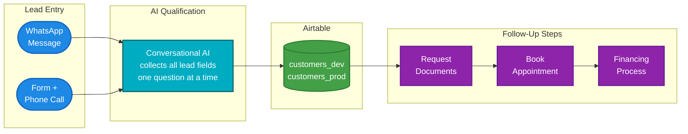
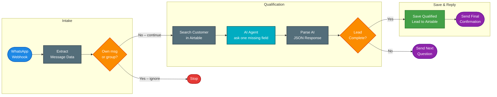
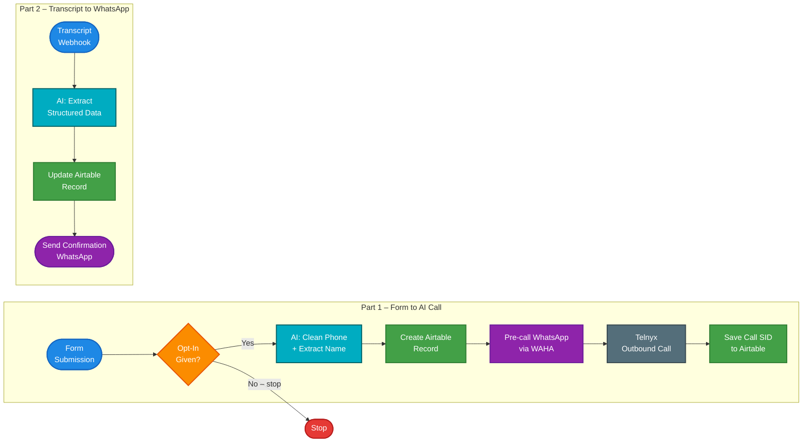

# Lead Process – Kameni n8n Lead Automation

This file explains the full lead process from first contact until the customer is ready for the financing follow-up.

It is written for:
- humans
- n8n builders
- AI tools
- future debugging

---

## 1. Main goal

The goal of this automation project is to collect financing leads, qualify them, save them in Airtable, and move qualified customers to the next financing step.

High-Level System Flow:



---

## 2. Main lead entry points

There are currently two main entry points:

```text
WhatsApp lead intake
Phone-call lead intake
```

### WhatsApp lead intake

The customer writes a WhatsApp message.

The WhatsApp workflow then:

```text
receives the message
checks if the customer already exists
asks one missing question at a time
collects buyer and financing information
saves or updates the customer in Airtable
```

Main workflow:

```text
workflows/whatsapp/whatsapp-lead-ingestion-main.json
```

Saving sub-workflow:

```text
workflows/whatsapp/save-qualified-lead-sub.json
```

---

### Phone-call lead intake

The customer submits a form and gives opt-in for a call.

The phone workflow then:

```text
cleans the phone number
creates a customer row
sends a pre-call WhatsApp message via WAHA (French)
starts a Telnyx AI outbound call
receives the post-call summary via Telnyx webhook tool
extracts structured lead data
updates Airtable
sends final confirmation WhatsApp message via WAHA (French)
```

Main workflow:

```text
workflows/phone/phone-call-lead-ingestion.json
```

---

## 3. Airtable tables

The project uses two Airtable customer tables:

```text
customers_dev  = test data
customers_prod = real live data
```

Simple rule:

```text
DEV workflows  → customers_dev
PROD workflows → customers_prod
```

The field `Environment` is kept as an extra safety label:

```text
customers_dev  → Environment = dev
customers_prod → Environment = prod
```

---

## 4. Source tracking

The project uses two fields to track how the customer came in and how they were last contacted:

```text
Original Source
Last Contact Channel
```

### Original Source

This is the first channel where the customer entered the system.

It should be set once when the row is created.

Example:

```text
Original Source = WhatsApp
```

### Last Contact Channel

This is the latest contact method.

It should be updated every time a new contact happens.

Example:

```text
First contact: Inbound Call
Original Source = Inbound Call
Last Contact Channel = Inbound Call

Second contact: WhatsApp
Original Source = Inbound Call
Last Contact Channel = WhatsApp

Third contact: Outbound Call
Original Source = Inbound Call
Last Contact Channel = Outbound
```

---

## 5. Main fields collected

The workflows try to collect the following information:

```text
Name
First Name
Email
Phone
Nationality
Age
Marital Status
Number of Children
Net Salary
Budget
Timeline
Mortgage Status
Property Type
Preferred Areas
Qualified Lead
```

These fields are explained in:

```text
docs/airtable-fields.md
```

---

## 6. Pipeline stages

Recommended pipeline stages:

```text
New
Qualifying
Awaiting Documents
Documents Validated
Booked
Lost
```

Simple meaning:

```text
New                 = lead was created
Qualifying          = AI/team is collecting missing information
Awaiting Documents  = customer should submit documents
Documents Validated = documents were received and checked
Booked              = appointment is booked
Lost                = lead will not continue
```

---

## 7. WhatsApp process

Simplified WhatsApp Flow:



Detailed explanation:

```text
docs/whatsapp-flow.md
```

Exact prompt backup:

```text
prompts/whatsapp-agent.md
```

---

## 8. Phone-call process

Simplified Phone Flow:



Detailed explanation:

```text
docs/phone-call-flow.md
```

Prompt backups:

```text
prompts/phone-contact-cleanup.md
prompts/phone-transcript-extraction.md
prompts/phone-confirmation-sms.md
```

---

## 9. Documents and next financing steps

After qualification, the customer should move toward the financing process.

Typical next steps:

```text
send Selbstauskunft link
request ID/passport
request last 3 salary slips
create documents folder
check uploaded documents
book appointment
create financing case
```

Related Airtable fields:

```text
Vorgangsnummer
ID Number
Selbstauskunft Submitted
Documents Folder URL
Documents Complete
Calendly Booking
```

---

## 10. DEV / PROD working rule

Use DEV first, then promote to PROD.

Simple development flow:

```text
n8n DEV workflow
        ↓
test with customers_dev
        ↓
export workflow JSON
        ↓
save to GitHub feature branch
        ↓
merge feature → dev
        ↓
merge dev → main
        ↓
import/update n8n PROD workflow
        ↓
real customers use PROD
```

Important:

```text
Do not edit PROD directly.
Do not test with customers_prod.
Do not send real customers to customers_dev.
```

---

## 11. Short project rule

```text
WhatsApp workflow = conversational lead qualification
Phone workflow    = form + AI call qualification
Airtable          = central customer database
GitHub            = version history
Jira              = task tracking
AI tools          = support building, documenting, and debugging
```
