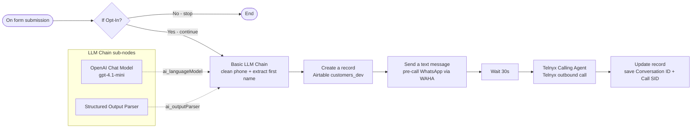
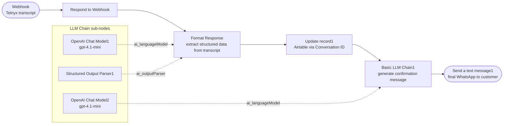

# Phone Call Flow – Human & AI Explanation

This file explains how the phone-call lead intake workflow works.

It is written for:
- humans who want to understand the automation
- AI tools that need project context
- future debugging and workflow changes

The exact prompts used in this workflow are stored in:

```text
prompts/phone-contact-cleanup.md
prompts/phone-transcript-extraction.md
prompts/phone-confirmation-sms.md
```

---

## 1. Purpose of the phone-call workflow

The phone-call workflow starts with a lead form, creates a customer in Airtable, sends a pre-call WhatsApp message, starts an AI phone call via Telnyx, receives the call transcript, extracts structured lead data, updates Airtable, and sends a final confirmation WhatsApp message.

Simple goal:

```text
Form submitted
→ create customer
→ send pre-call WhatsApp
→ start Telnyx AI call
→ receive transcript
→ extract lead data
→ update Airtable
→ send confirmation WhatsApp
```

---

## 2. Workflow name

```text
Phone Lead Ingestion - DEV
```

This workflow currently has two main parts:

```text
Part 1 = form submission → Telnyx outbound AI call
Part 2 = Telnyx transcript webhook → Airtable update → WhatsApp confirmation
```

---

## 3. Workflow diagrams

### Part 1 – Form submission to outbound call



### Part 2 – Transcript webhook to confirmation WhatsApp



---

## 4. Part 1 – Form submission and call start

### Step 1 – Form is submitted

Node:

```text
On form submission
```

Purpose:

```text
Receives the first customer information from a simple form.
```

Collected fields:

```text
Customer Name
Email
Phone Number
Opt in
```

---

### Step 2 – Check Opt-In

Node:

```text
If Opt-In
```

Purpose:

```text
Continues only if the customer selected Yes.
```

Simple rule:

```text
Opt in = Yes → continue
Opt in = No  → stop
```

This protects the workflow from calling customers who did not agree.

---

### Step 3 – Clean phone number and first name

Node:

```text
Basic LLM Chain
```

Purpose:

```text
Formats the phone number and extracts the customer first name.
```

The AI receives:

```text
Customer Phone Number
Customer First Name / Customer Name
Customer Email Address
```

It returns:

```text
Customer Phone Number in E.164 format
Customer First name
Customer Email Address
```

Example:

```text
0049 151 23456789 → +4915123456789
Maria Becker → Maria
```

---

### Step 4 – Create Airtable customer

Node:

```text
Create a record
```

Purpose:

```text
Creates the first Airtable row before the call starts.
```

DEV workflow should write to:

```text
customers_dev
```

PROD workflow should write to:

```text
customers_prod
```

Recommended field mapping:

```text
Name = Customer Name
First Name = extracted first name
Email = customer email
Phone = cleaned E.164 phone number
Opt In = true
Environment = dev or prod
Pipeline Stage = Qualifying
Original Source = Form
Last Contact Channel = Form
Age = 0
Number of Children = 0
Net Salary = 0
Budget = 0
```

Important:

```text
If the call is started because the customer submitted a form,
Original Source should be Form.
```

---

### Step 5 – Send pre-call WhatsApp message

Node:

```text
Send a text message
```

Purpose:

```text
Sends a WhatsApp message via WAHA telling the customer that an AI agent will call them shortly.
```

Example meaning:

```text
Thanks for opting in. Our AI agent will call you soon. Please accept the call and answer the screening questions.
```

---

### Step 6 – Wait before calling

Node:

```text
Wait
```

Purpose:

```text
Waits 30 seconds before starting the call.
```

Why:

```text
Gives the customer a small pause after receiving the WhatsApp message.
```

---

### Step 7 – Start Telnyx outbound call

Node:

```text
Telnyx Calling Agent
```

Purpose:

```text
Starts the outbound AI phone call through Telnyx.
```

It sends:

```text
agent_id
agent_phone_number_id
to_number
```

Important security rule:

```text
Do not store API keys directly inside exported workflow JSON.
Use n8n credentials or environment variables instead.
```

---

### Step 8 – Save call IDs in Airtable

Node:

```text
Update record
```

Purpose:

```text
Updates the Airtable row with the call identifiers.
```

Recommended fields:

```text
Conversation ID = Telnyx conversation ID
Call SID = Telnyx call SID
Call Status = Initiated
```

---

## 5. Part 2 – Transcript webhook and lead extraction

### Step 9 – Transcript webhook receives call result

Node:

```text
Webhook
```

Purpose:

```text
Receives the call transcript from Telnyx after the AI call.
```

Expected data includes:

```text
conversation_id
transcript
```

---

### Step 10 – Respond quickly to webhook

Node:

```text
Respond to Webhook
```

Purpose:

```text
Confirms that the transcript was received.
```

Example response:

```json
{
  "status": "received",
  "message": "Transcript accepted for processing"
}
```

---

### Step 11 – Extract structured data from transcript

Node:

```text
Format Response
```

Purpose:

```text
Reads the phone transcript and extracts the customer's answers.
```

The exact prompt is stored in:

```text
prompts/phone-transcript-extraction.md
```

The AI extracts:

```text
nationality
age
maritalStatus
numberChildren
netSalary
budgetRange
timeline
mortgageStatus
propertyType
preferredAreas
qualifiedLead
```

Important:

```text
The AI should extract only the customer's answers,
not the agent's questions.
```

---

## 6. Fixed values for transcript extraction

The extracted values must match Airtable select values exactly.

### Marital Status

```text
Single
Married
Divorced
Widowed
Unknown
```

### Timeline

```text
0-3 months
3-6 months
6-12 months
12+ months
Just exploring
```

### Mortgage Status

```text
No mortgage yet - needs help
Mortgage in principle
Mortgage approved
Already has mortgage
Unknown
```

### Property Type

```text
Apartment
House
Detached house
Semi-detached house
Plot of land
Commercial
Other
```

### Call Status

```text
Not Initiated
Initiated
Answered
Completed
Failed
No Answer
```

---

## 7. Update customer after transcript

Node:

```text
Update record1
```

Purpose:

```text
Updates the customer row using the extracted transcript data.
```

Matching field:

```text
Conversation ID
```

Recommended update fields:

```text
Age
Budget
Call Status = Completed
Conversation ID
Marital Status
Mortgage Status
Nationality
Net Salary
Number of Children
Pipeline Stage = Awaiting Documents
Preferred Areas
Property Type
Qualified Lead
Timeline
Last Contact Channel = Outbound
```

Important:

```text
Do not change Original Source during transcript update.
Only update Last Contact Channel.
```

---

## 8. Generate confirmation message

Node:

```text
Basic LLM Chain1
```

Purpose:

```text
Creates a short friendly WhatsApp message confirming the customer information was saved.
```

Current behavior:

```text
Generates a French confirmation message.
```

Example meaning:

```text
Hello Maria, your information has been saved. We will contact you with the next steps for your financing request.
```

---

## 9. Send final WhatsApp message

Node:

```text
Send a text message1
```

Purpose:

```text
Sends the final confirmation WhatsApp message to the customer via WAHA.
```

The message is sent to the phone number stored in Airtable.

---

## 10. Airtable table rules

The project uses two tables:

```text
customers_dev
customers_prod
```

Simple rule:

```text
DEV workflow  → customers_dev
PROD workflow → customers_prod
```

Environment field:

```text
customers_dev  → Environment = dev
customers_prod → Environment = prod
```

Source tracking:

```text
Original Source = first channel where the lead came from
Last Contact Channel = latest channel used
```

For this phone-call workflow:

```text
Original Source = Form when the customer starts from the form
Last Contact Channel = Form when the form creates the row
Last Contact Channel = Outbound when the Telnyx AI call happens
```

---

## 11. Recommended DEV/PROD behavior

### DEV workflow

```text
Table = customers_dev
Environment = dev
Use test phone numbers
Use test credentials if possible
```

### PROD workflow

```text
Table = customers_prod
Environment = prod
Use real phone number
Use production credentials
```

---

## 12. GitHub and workflow versioning

Do not mainly edit complex n8n workflows manually in JSON.

Recommended process:

```text
1. Create feature branch from dev
2. Make changes visually in n8n DEV workflow
3. Test with customers_dev
4. Export workflow JSON
5. Replace JSON file locally
6. Commit and push feature branch
7. Pull request: feature → dev
8. Pull request: dev → main
9. Import main version into n8n PROD workflow
```

Simple meaning:

```text
n8n DEV = where you build/test
GitHub = where you save/review versions
n8n PROD = where the stable workflow runs live
```

---

## 13. Common mistakes to avoid

```text
Do not call customers without Opt-In.
Do not test with customers_prod.
Do not send real customers to customers_dev.
Do not store API keys directly in workflow JSON.
Do not delete Airtable fields before checking n8n mappings.
Do not rename Airtable fields without updating n8n nodes.
Do not change Original Source after the row was created.
Do update Last Contact Channel when a new contact happens.
```

---

## 14. Short summary

```text
Form collects basic customer data
Opt-In protects consent
AI cleans phone and first name
Airtable row is created
WhatsApp warns customer about call
Telnyx starts outbound call
Call IDs are saved
Transcript webhook receives call result
AI extracts structured financing data
Airtable is updated
Final WhatsApp confirms saved data
```

Most important rule:

```text
Initial form creates the lead.
Telnyx AI phone call completes the qualification.
Transcript extraction updates the same Airtable row.
```
